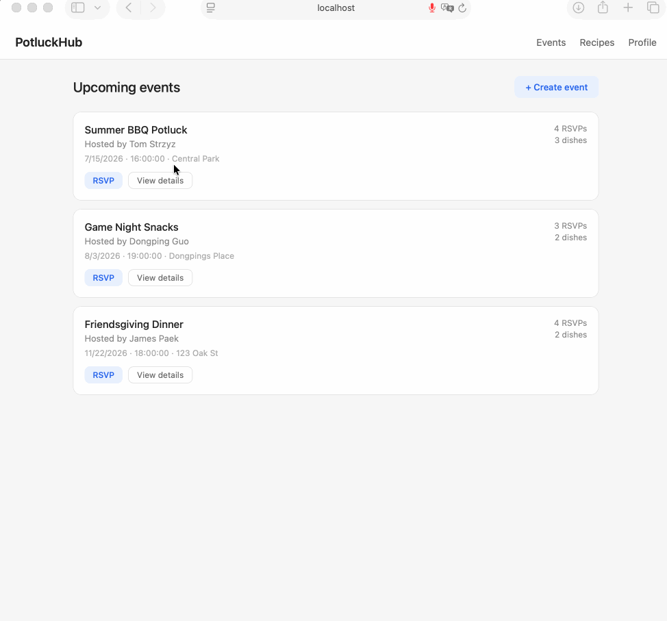

# PotluckHub

CodePath WEB103 Final Project

Designed and developed by: Tom Strzyz, Dongping Guo, James Paek, Eman Gurung

🔗 Link to deployed app: https://github.com/jamespaek1/web103_finalproject

## About

### Description and Purpose

PotluckHub is a full-stack web application that makes organizing potluck gatherings simple and stress-free. Users can create potluck events, browse a shared recipe library, claim dishes they plan to bring, and leave ratings and reviews on dishes after the event. The app eliminates the classic potluck problem of five people bringing potato salad and nobody bringing plates — by giving everyone visibility into what's already been claimed, hosts and guests can coordinate effortlessly.

### Inspiration

We were inspired by our own experiences trying to plan group meals with friends and family. Coordinating who's bringing what usually involves a messy group chat or a shared spreadsheet that nobody updates. We wanted to build a purpose-built tool that makes the process fun and organized, while also creating a growing recipe collection that users can revisit for future events.

## Tech Stack

Frontend: React, React Router, CSS

Backend: Express, PostgreSQL, Node.js

## Features

### ✅ 1. Event Creation and Management (Baseline)

Users can create new potluck events with a title, description, date, time, and location. Events can be edited or deleted by the host. All CRUD operations (GET, POST, PATCH, DELETE) are supported for events.

### ✅ 2. Recipe Library with Full CRUD (Baseline)

Users can browse, add, edit, and delete recipes in a shared recipe library. Each recipe includes a name, description, category (appetizer, main, side, dessert, drink), and an image URL.

### ✅ 3. Dish Claiming System (Baseline)

Users can claim a recipe to bring to a specific event using a many-to-many relationship between events and recipes via an `event_dishes` join table. Users can also unclaim a dish if plans change.

### ✅ 4. User Profiles with Hosted Events (Baseline)

Each user has a profile page displaying their name, bio, and a list of events they are hosting. The one-to-many relationship between users and events is displayed here.

### ✅ 5. Event RSVP System (Baseline)

Users can RSVP to events they want to attend. The app tracks who is attending each event through a many-to-many relationship between users and events via an `rsvps` join table.

### ✅ 6. Database Reset (Baseline)

The app includes a mechanism to reset the database back to its default seeded state, restoring all original sample data for events, recipes, and users.

### 7. Filter and Sort Recipes (Custom Feature)

Users can filter the recipe library by category (appetizer, main, side, dessert, drink) and sort recipes alphabetically or by rating. Filtering and sorting happen on the same page without navigation.

### 8. Dish Claim Modal (Custom Feature)

When a user wants to claim a dish for an event, a modal pops up over the current page displaying available recipes to choose from. The user can select a recipe and confirm their claim without navigating away from the event page.

### ✅ 9. Dynamic Route Navigation (Baseline)

The app uses React Router to create dynamic frontend routes for individual event pages (`/events/:id`) and user profile pages (`/users/:id`), enabling deep linking and browser navigation.

### 10. Deployment on Render (Baseline)

The complete application — frontend and backend — is deployed on Render with all pages and features fully functional and accessible via a public URL.

### Entity Relationships

## Installation Instructions

1. Fork and clone the repository.
2. Navigate to the `server` directory and run `npm install` to install backend dependencies.
3. Create a `.env` file in `server` with your PostgreSQL connection string: `DATABASE_URL=your_connection_string_here`.
4. Run `npm run setup` to create and seed the database.
5. Run `npm start` to start the backend server.
6. In a new terminal, navigate to the `client` directory and run `npm install` to install frontend dependencies.
7. Run `npm run dev` to start the React development server.
8. Open `http://localhost:5173` in your browser.
