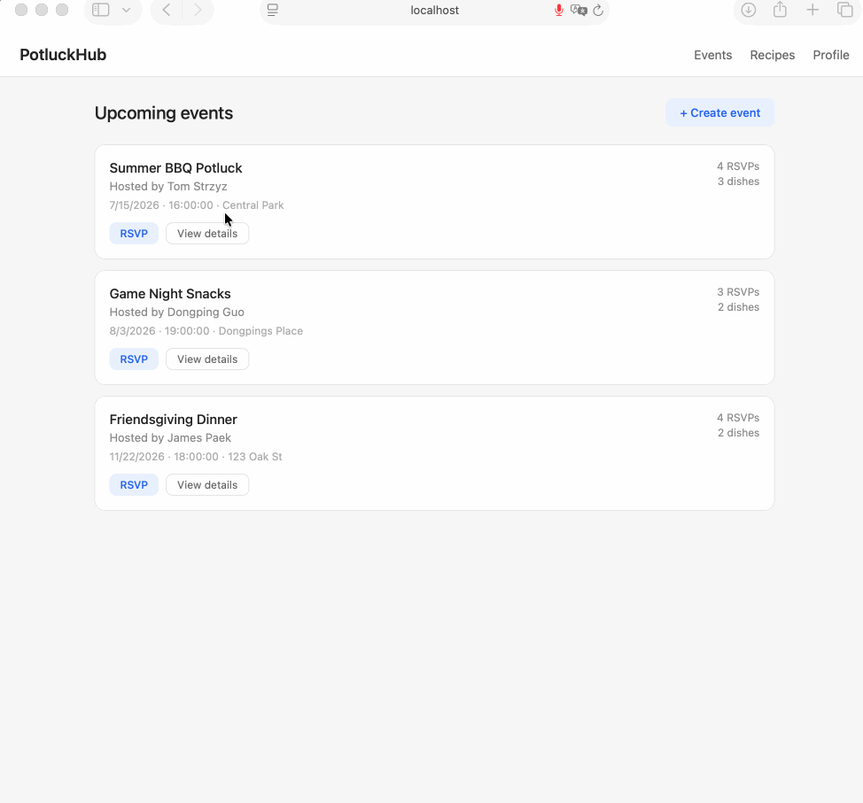
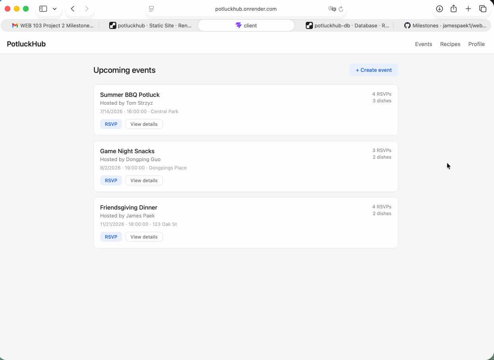
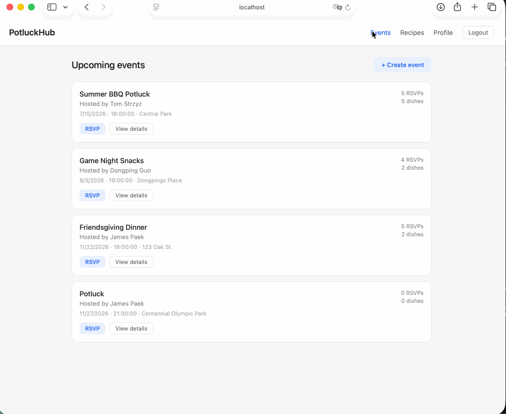

# PotluckHub

A collaborative full-stack application for organizing potluck events, coordinating RSVPs, managing recipes, and claiming dishes.

[View the public project demo](https://jamespaek1.github.io/web103_finalproject/) · [Explore the source](https://github.com/jamespaek1/web103_finalproject)

Designed and developed by Tom Strzyz, Dongping Guo, James Paek, and Eman Gurung for the CodePath WEB103 final project.

## Project overview

Group meals are often coordinated through scattered messages and spreadsheets. PotluckHub gives hosts and guests one shared place to create an event, see who is attending, browse recipes, and claim dishes without duplicating what someone else is bringing.

## Approach

The team built a Vite-powered React client, an Express REST API, and a PostgreSQL data model. The application connects users, events, recipes, RSVPs, and dish claims; GitHub OAuth provides account access, while React Router supports event and profile pages.

## Features

- Create, edit, browse, and remove potluck events.
- Browse, filter, sort, create, and update recipes.
- RSVP to an event and see its guest list.
- Claim or unclaim a recipe for a specific event.
- View hosted events, RSVPs, and claimed dishes on user profiles.
- Navigate directly to event and profile pages with dynamic routes.
- Upload food images through Cloudinary in the full-stack build.

## Outcomes

- Delivered a five-table PostgreSQL model connecting users, events, recipes, RSVPs, and claimed dishes.
- Integrated React, Express, PostgreSQL, GitHub OAuth, image uploads, and REST endpoints into one application.
- Completed three recorded end-to-end demonstrations of the product.
- Added a stable, read-only GitHub Pages demo so reviewers can access project evidence without a login or suspended service.

## My contribution

This was a four-person CodePath project. My Git history documents responsibility for final repository integration and project presentation: consolidating client and server work, assembling milestone documentation and demo media, completing the Milestone 5 handoff, and resolving final merge conflicts. I can speak to how the user interface, API, relational model, and deployment package were assembled.

## Project evidence

### Core event, recipe, RSVP, and dish workflows



### Dish-claim modal and dynamic navigation



### Final integrated walkthrough



## Technology

- **Frontend:** React, React Router, Vite, CSS
- **Backend:** Node.js, Express, Passport
- **Data:** PostgreSQL
- **Integrations:** GitHub OAuth, Cloudinary
- **Deployment evidence:** GitHub Pages

## Run locally

### 1. Configure the API

```bash
cd server
cp .env.example .env
npm install
npm run setup
npm start
```

Supply local values for the variables listed in `server/.env.example`. Keep the completed `.env` file private.

### 2. Start the client

```bash
cd client
npm install
npm run dev
```

Open `http://localhost:5173`. The client expects the API at `http://localhost:3001` unless `VITE_API_URL` is set.

## Deployment status

The original Render deployment is currently offline. The [public project demo](https://jamespaek1.github.io/web103_finalproject/) is the stable replacement for portfolio review and contains all three recorded walkthroughs. The interactive backend should remain offline until its credentials are rotated and authorization controls are verified.

## Security note

- Never commit `.env`, database credentials, OAuth secrets, or Cloudinary secrets.
- Database reset is disabled unless a developer explicitly opts in locally.
- API mutations require an authenticated session in the hardened source.
- Use test data rather than personal information when demonstrating the project.
