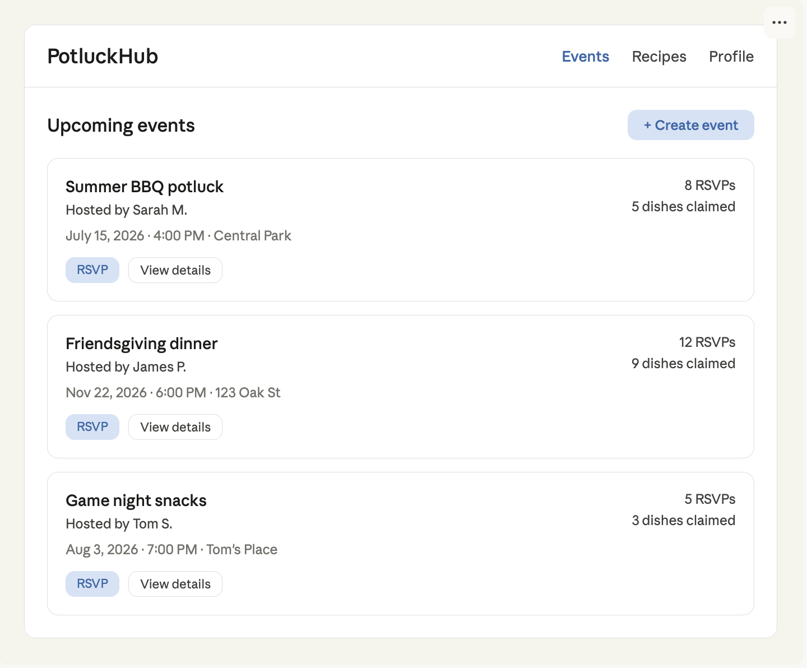
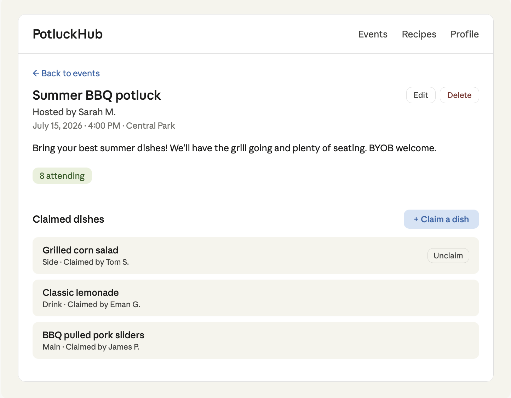
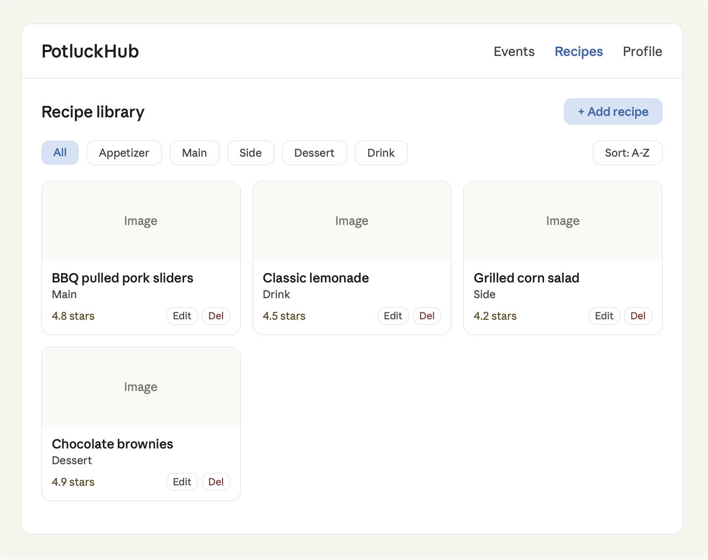

# Wireframes

These wireframes established the primary navigation and workflows before implementation.

## Page inventory

- Events list (home page)
- Event detail page
- Recipe library
- User profile page
- Create/edit event form
- Create/edit recipe form

## Events list

The home page displays navigation links, a create-event action, and event cards. Each card summarizes the host, date, location, RSVP count, dish count, and next actions.

## Event detail

The event detail page shows the title, host, date, time, location, description, RSVP count, and claimed dishes. Hosts can edit or delete their event. Guests can open the claim-dish workflow and unclaim a dish they previously selected.

## Recipe library

The recipe library displays image, name, category, and rating information in a card grid. Category filters and sorting controls help users find dishes, while authorized users can add or update recipes.

